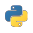

# Popular Programing Languages

This is a list of most populat programing languages according to TIOBE index :). 

I hope you find your favorite one :))). 

### **[1. Python](Python.md)** 

### **[original website](https://en.wikipedia.org/wiki/Python_(programming_language))**

---
### **[2. C](C.md)** 

### **[original website](https://en.wikipedia.org/wiki/C_(programming_language))**

---
### **[3. C++](C++.md)** 

### **[original website](https://en.wikipedia.org/wiki/C++)**

---
### **[4. Java](Java.md)** 

### **[original website](https://en.wikipedia.org/wiki/Java_(programming_language))**

---
